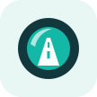
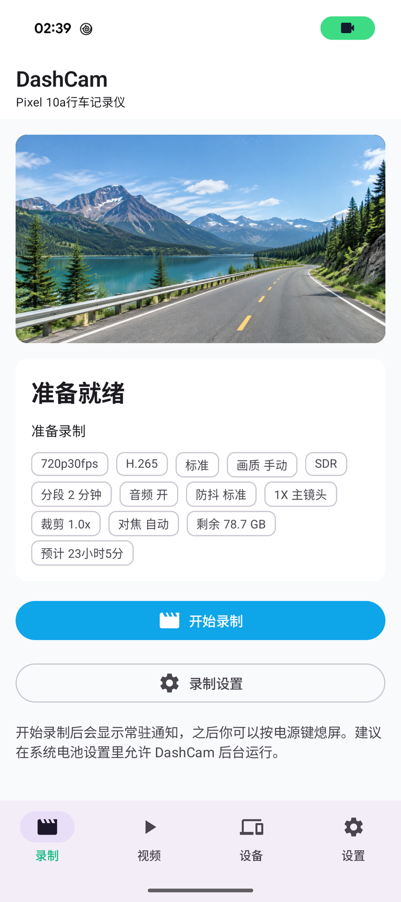
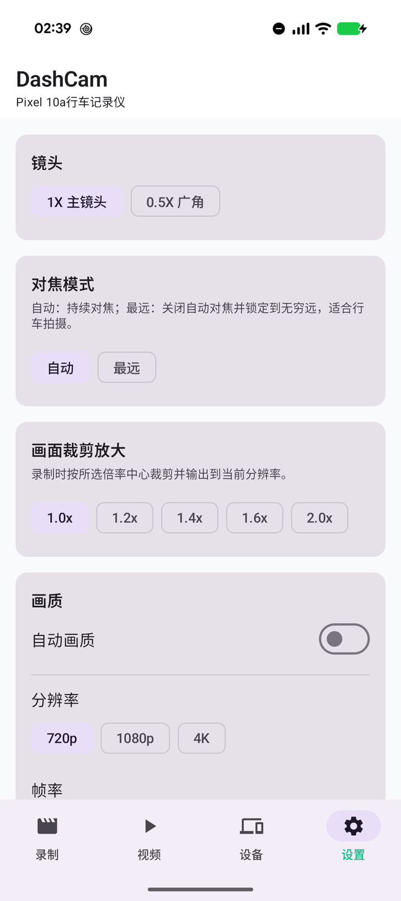
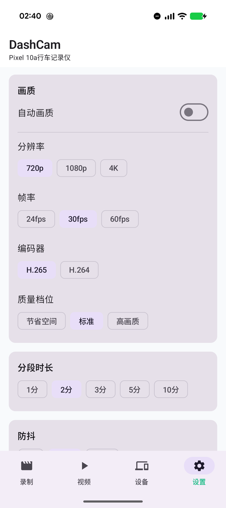

<h1 align="center">DashCam</h1>

<p align="center">
  
</p>

<p align="center">让你的 Android 手机成为行车记录仪。</p>

<p align="center">
  <a href="README.md">English</a> · <strong>简体中文</strong>
</p>

<p align="center">
  <a href="https://developer.android.com/"></a>
  <a href="LICENSE"></a>
  <a href="https://github.com/xxxifan/DashCam/stargazers"></a>
  <a href="https://github.com/xxxifan/DashCam/fork"></a>
</p>

<p align="center">
  <a href="https://github.com/xxxifan/DashCam/releases">版本下载</a> ·
  <a href="#快速开始">快速开始</a> ·
  <a href="https://github.com/xxxifan/DashCam/issues">问题反馈</a> ·
  <a href="#参与贡献">参与贡献</a>
</p>

## 应用简介

DashCam 是一款开源 Android 行车记录仪应用，既能使用手机摄像头记录行程，也能连接外部记录仪查看和下载录像。应用基于 CameraX，集成自动分段、循环存储和本地视频管理，并根据设备能力与可用资源调整录制画质。

## 界面预览

| 录制预览 | 镜头设置 | 画质设置 |
| :---: | :---: | :---: |
|  |  |  |

<sub>截图来自 Pixel 10a，仅摄像头预览区域替换为 AI 生成的风景示意图。</sub>

## 主要功能

- **循环录制** — 前台持续录制，支持 1～10 分钟分段，自动清理旧片段。
- **丰富的录制设置** — 支持 720p / 1080p / 4K、24 / 30 / 60 fps、H.264 / H.265、HDR、防抖、镜头切换、对焦和裁剪放大，具体取决于设备能力。
- **自动画质与安全策略** — 根据设备能力和可用空间选择画质，监控存储、温度、电量与录制状态，必要时降档或停止；默认预留 10% 存储空间。
- **录音与降噪** — 可选录音，录制结束后针对检测到的风噪等支持的噪声类型进行降噪处理。
- **录像管理** — 缩略图、连续播放、批量清理、导出和分享。
- **外部记录仪** — 支持艾尔优 DC1 实时预览、远端播放和断点下载，可将 TS 无损转封装为 MP4。
- **诊断日志** — 记录录制事件和外部设备操作，方便排查连接失败与异常停止原因。

基于 Kotlin、Jetpack Compose、CameraX、Media3 和 MMKV 构建。

## 快速开始

**需要 Android 16+ 和 ARM64 设备。** 前往 [Releases](https://github.com/xxxifan/DashCam/releases) 查看已发布版本，也可以按下方说明自行构建。

1. 打开应用，授予相机、通知权限，需要录音时再授予麦克风权限。
2. 选择画质和存储设置，点击 **开始录制**。
3. 在 **视频** 页管理录像；使用艾尔优 DC1 时，先连接记录仪 Wi-Fi，再打开 **设备** 页。

手机录像默认保存在应用专属目录，重要视频请在卸载前导出。锁屏录制和高级相机选项因设备而异，长途使用前建议先测试。

<details>
<summary><strong>从源码构建</strong></summary>

使用 Android Studio，准备 JDK 17 和 Android SDK 36。在 Windows 中运行：

```powershell
git clone https://github.com/xxxifan/DashCam.git
cd DashCam
.\gradlew.bat assembleDebug
.\gradlew.bat installDebug
```

安装前请开启手机 USB 调试。APK 位于 `app/build/outputs/apk/debug/app-debug.apk`。

Release 构建需要自己的签名密钥和 `DASHCAM_RELEASE_*` 配置，详见 [app/build.gradle.kts](app/build.gradle.kts)。

</details>

## 参与贡献

**欢迎 Star 和 Fork！** 点一个 Star 支持项目，或 [Fork 仓库](https://github.com/xxxifan/DashCam/fork) 按自己的需求改进。也欢迎修复问题、完善文档、分享设备兼容性测试结果。

- **发现问题？** [提交 Issue](https://github.com/xxxifan/DashCam/issues)，附上设备型号、Android 版本和复现步骤；录制问题可补充设置，外部记录仪问题可补充固件版本。
- **有改进想法？** 提交 Pull Request，简要说明改动和测试结果；较大改动请先通过 Issue 讨论。

## 许可证

[Apache License 2.0](LICENSE)
